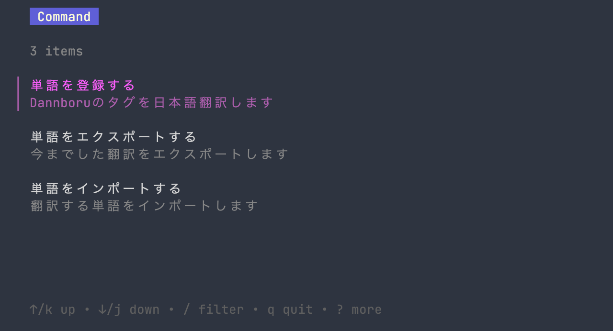
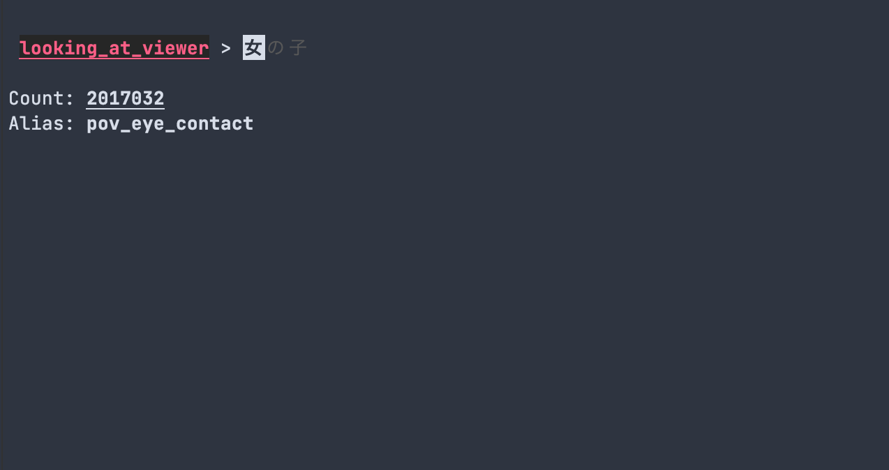

# About
[Danbooru](https://danbooru.donmai.us/)のタグを日本語化するためのリポジトリです

全てを日本語化することは無理なのでよく使われるタグの数百個を目安にやっていきます

本来の目的は自作のDanbooruクライアント、Boorutan ( 名称未定 )で使うためのものですが、その他の用途にもお使いいただけます

# How to use `danbooru-jp.csv`
翻訳したものは`app.db`や`danbooru-jp.csv`に入っています、適当に取り出してください

`danbooru-jp.csv`に関しては[webui tag complete](https://github.com/DominikDoom/a1111-sd-webui-tagcomplete)と互換性があります
```
 ~/stable-diffusiton-webui/extensions/a1111-sd-webui-tagcomplete/tags
```
1. このリポジトリから`danbooru-jp.csv`ファイルをダウンロードする
2. まだ拡張機能を入れてないならwebui tag completeをダウンロードする
3. tagsの中 (上参照) に`danbooru-jp.csv`ファイルを置き
4. webuiを起動し
5. **webui**から**Settings**を開き、サイドバーから**Autocomplete**を選択する
6. 設定項目、**Translation filename**で`danbooru-jp.csv`を選択する ( 無い場合は横の`🔄`ボタンを押す )

これで日本語で`女`と入力すると`1girl`などがサジェストに出るようになりました。

# How to use `main.go`

> 上の画像では`単語を登録する`になっていますが誤記です

`main.go`で単語の翻訳、インポート、エクスポートを行うことができます

エクスポートでは翻訳したものが`danbooru-jp.csv`でエクスポートされ、インポートでは`danbooru.csv`のタグがインポートされます。
まだファイル名などを指定することは出来ません


`単語を翻訳する`を選ぶと翻訳画面が出ます、赤く光っている単語が翻訳する単語で、`女の子`と`placeholder`が出ている場所に入力します

`Enter`を押すと入力が確定され次に進みます、出てくる単語はまだ翻訳されておらず、翻訳されていないものの中で上位5個がランダムで出てきます

間違えて入力してしまった場合どうするかって?、`sqlite3 app.db`, `SELECT ...`, `UPDATE ...`, ...略

# License
under the `MIT License`